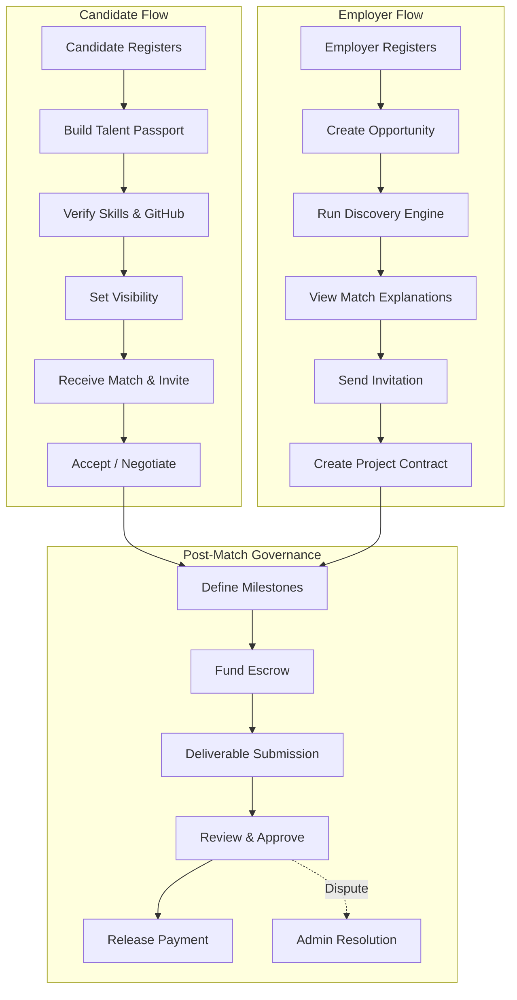
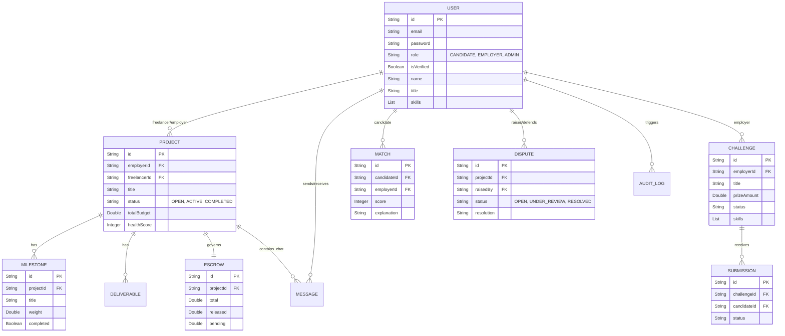

# TALENTX Complete Project Documentation

> **TALENTX** is a revolutionary AI-powered freelance marketplace explicitly designed to fix the broken talent acquisition model. Through verifiable skills, escrow-backed milestone governance, and multi-dimensional matchmaking, TalentX ensures that both candidates and employers thrive in a high-trust, decentralized-style ecosystem.

---

## 1. Problem Statement

* **Application black holes:** candidates can submit many applications without useful feedback.
* **Screening overload:** employers must sort large applicant pools.
* **Keyword filtering** can miss capable candidates.
* **Self-reported skills** lack strong evidence.
* **Candidates** have limited control over how and when employers discover them.

## 2. System Architecture

The TalentX platform is constructed as a modern, decoupled monolithic stack prioritizing performance, type safety, and real-time responsiveness.

### Tech Stack
* **Frontend:** React 18, Tailwind CSS, Framer Motion, Lucide Icons, Axios.
* **Backend:** Java 26.0.2, Spring Boot 3.x, Spring Security (Stateless JWT), Spring Data MongoDB.
* **Database:** MongoDB (NoSQL) for highly flexible, document-based data structures.
* **Authentication:** Stateless JWT stored securely on the client, passed via Authorization headers.

### File Dependency Flow
```
React Page
   ↓
React Component
   ↓
Service file (HTTP request)
   ↓
Spring Boot Controller
   ↓
DTO validation
   ↓
Service layer
   ↓
Repository
   ↓
MongoDB
```

---

## 3. Data Flow Diagram (DFD)

The following Mermaid diagram maps out the high-level Data Flow within the TALENTX system.



---

## 4. Entity-Relationship (ER) Diagram

The following Mermaid diagram maps out the NoSQL document collections and their logical relationships within the system.



---

## 5. Core Modules & Features

### 5.1 Talent Module (Candidates)
* **Talent Passport:** A dynamic resume built from verified skills rather than static text.
* **Match Discovery:** Candidates receive AI-scored matches tailored to their specific skill weightings and preferences.
* **Challenge Participation:** Ability to complete micro-tasks posted by employers to earn day-1 revenue and prove technical capability.
* **Project Execution:** Milestone-driven task management ensuring payment is released sequentially as work is verified.

### 5.2 Employer Module
* **Discovery Engine:** Browse the global talent pool via complex MongoDB aggregations filtering by verified skills, availability, and trust scores.
* **Challenge Creation:** Post highly specific tasks (bounties) with escrowed prize pools to crowdsource solutions.
* **Project Governance:** Oversee active projects, review deliverables, and approve milestones to release funds from escrow.
* **Real-time Chat:** Communicate directly with candidates and freelancers inside project rooms.

### 5.3 Admin Module
* **Platform Analytics:** Real-time metrics on user growth, transaction volume, and platform health.
* **Dispute Resolution:** A specialized room to arbitrate conflicts between employers and freelancers regarding milestones or quality.
* **Verification Queue:** Manually review user identities, business registrations, and external skill certificates.
* **Audit Trails:** Immutable, cryptographically hashed logs tracking every sensitive action (escrow release, dispute resolution, user suspension).

---

## 6. API Endpoint Strategy

The backend follows a strict RESTful convention:

| Resource | Endpoints | Description |
|---|---|---|
| **Auth** | `/api/auth/register`, `/login` | Stateless JWT issuance. |
| **Users** | `/api/users/me`, `/api/users/{id}` | Profile and Talent Passport management. |
| **Projects** | `/api/projects`, `/api/projects/{id}` | Creation and tracking of governed projects. |
| **Milestones** | `/api/projects/{id}/milestones` | Milestone sub-resource management. |
| **Escrow** | `/api/projects/{id}/escrow` | Financial hold tracking per project. |
| **Challenges** | `/api/challenges`, `/api/challenges/{id}/submissions` | Micro-task bounty boards. |
| **Matches** | `/api/matches`, `/api/matches/candidate/{id}` | Algorithmic talent-employer matching. |
| **Disputes** | `/api/disputes`, `/api/disputes/{id}/resolve` | Arbitration and conflict resolution. |
| **Admin** | `/api/admin/audit`, `/api/admin/stats` | Global platform governance. |

---

## 7. Setup & Deployment

To run the full stack locally:

1. **Database:** Ensure MongoDB is connected via the provided MongoDB Atlas connection string with a database named `talentx`.
2. **Backend:** Navigate to `backend/` and execute `mvn clean install` followed by `mvn spring-boot:run`. The server will bind to `localhost:8080`.
3. **Frontend:** Navigate to `frontend/` and execute `npm install` followed by `npm run dev`. The React application will bind to the designated Vite/React port.

> [!TIP]
> Use the provided `start-talentx.ps1` script in the root directory to simultaneously launch both the frontend and backend with a single command.

---

*Documentation generated by Antigravity IDE (August 2026).*
