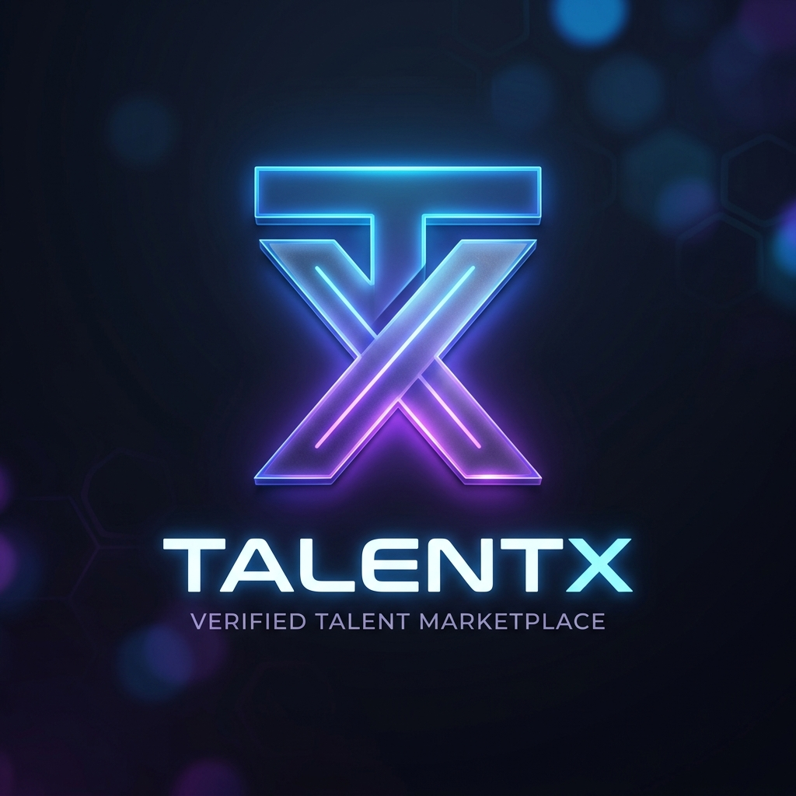
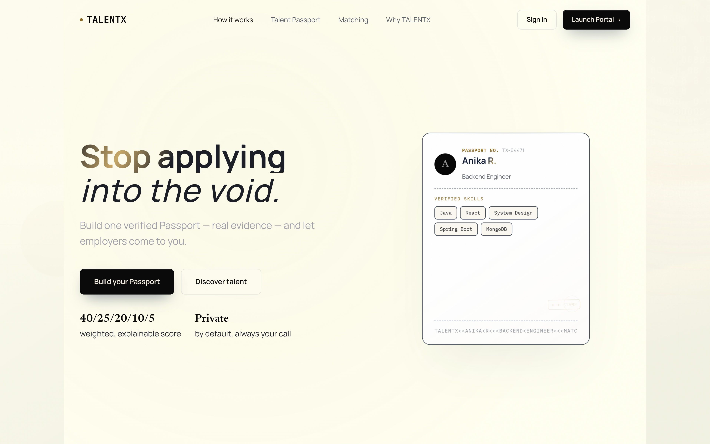
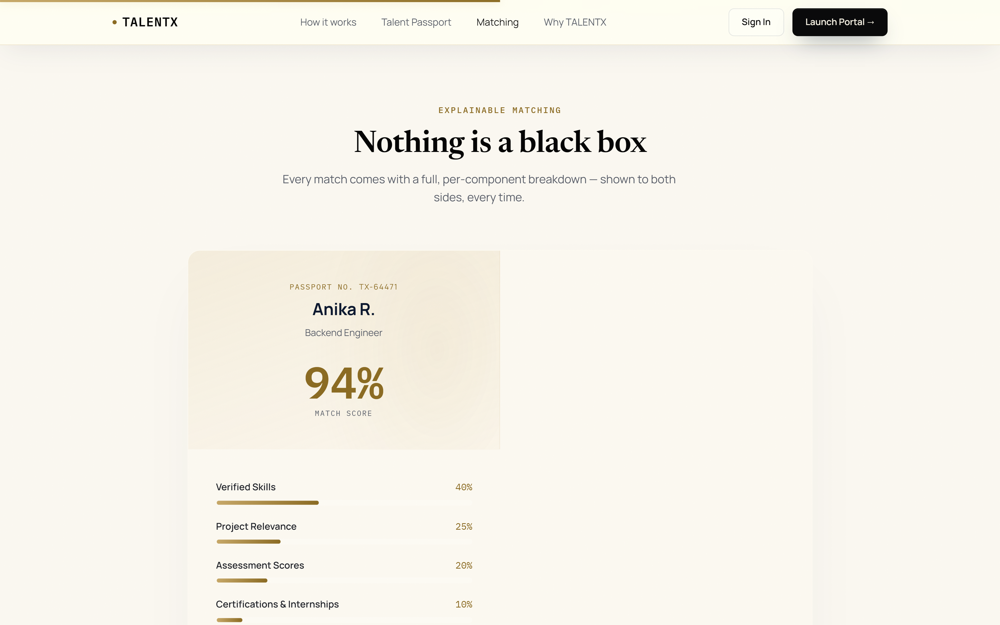
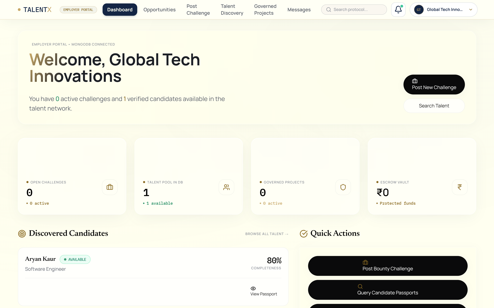
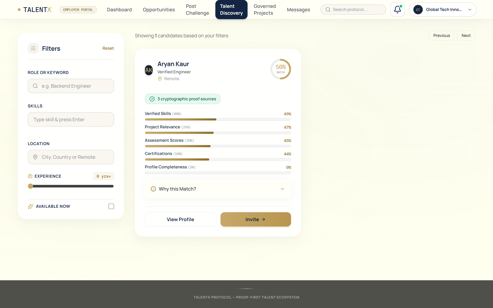

<div align="center">
  
  
  <h1>TalentX - The Verified Talent Marketplace</h1>
  
  <p>
    Bridging the gap between skilled professionals and employers through verified competence.
  </p>
  
  <p>
    <a href="https://talentx-h7lr.onrender.com"><strong>View Live Demo</strong></a> ·
    <a href="#features"><strong>Explore Features</strong></a> ·
    <a href="#getting-started"><strong>Getting Started</strong></a>
  </p>

  <p>
    
    
    
    
    
  </p>
</div>

<br />

## 📖 Overview

The hiring landscape is broken. Resumes are easily exaggerated, and finding candidates with genuinely verified skills takes far too much time. **TalentX** is a modern full-stack web application designed to solve this problem by ensuring that every skill, milestone, and project on a candidate's profile is authentically verified.

Whether you are a professional building a "Skill Passport" or an employer seeking guaranteed talent, TalentX provides a seamless, secure, and intuitive platform to connect and collaborate.

---

## ✨ Key Features

- 🛂 **Verified Skill Passports:** Candidates build comprehensive profiles with verifiable evidence and milestone tracking.
- 🔍 **Seamless Discovery:** Advanced search and matching algorithms for employers to find exact-fit talent.
- 🔒 **Secure Collaboration:** Integrated milestone tracking and Escrow management for project deliverables.
- 🎨 **Immersive UI/UX:** A sleek, dark-mode dashboard built with Tailwind CSS, Framer Motion, GSAP, and Three.js.
- 🛡️ **Enterprise Security:** JWT-based stateless authentication and Spring Security authorization.

---

## 🛠️ Tech Stack

### Frontend
- **Framework:** React 19 + Vite
- **Styling:** Tailwind CSS, Radix UI
- **Animations:** Framer Motion, GSAP, React Three Fiber (Three.js)
- **Forms & Validation:** React Hook Form, Zod
- **Routing:** React Router DOM v7

### Backend
- **Core:** Java 21, Spring Boot 3
- **Security:** Spring Security, JWT
- **Database:** MongoDB (Spring Data MongoDB)
- **Email:** Spring Mail (Transactional notifications)

### DevOps & Deployment
- **Containerization:** Docker (Multi-stage builds)
- **CI/CD:** GitHub Actions
- **Hosting:** Render.com (Monolithic deployment)

---

## 🎥 Platform Demo

Watch the TalentX platform in action:

<div align="center">
  <video src="https://github.com/ManthanJain777/TalentX--Final/raw/main/preview/media1.mp4" controls="controls" width="100%"></video>
</div>

---

## 📸 Platform Previews

| Feature | Interface |
| :---: | :---: |
|  |  |
|  |  |

---

## 🚀 Getting Started

Follow these instructions to set up the project locally for development and testing.

### Prerequisites
- Node.js (v20+)
- Java JDK 21
- Maven
- MongoDB (Running locally or MongoDB Atlas)
- Docker (Optional)

### Local Development

**1. Clone the repository**
```bash
git clone https://github.com/ManthanJain777/TalentX--Final.git
cd TalentX--Final
```

**2. Setup Backend Environment Variables**
Navigate to the backend directory and create an environment file:
```bash
cd backend
cp .env.example .env
```
*Populate the `.env` file with your MongoDB URI, JWT Secret, and SMTP credentials.*

**3. Run the Backend (Spring Boot)**
```bash
mvn spring-boot:run
```
*The backend will start on `http://localhost:8080`.*

**4. Run the Frontend (React/Vite)**
Open a new terminal and navigate to the frontend directory:
```bash
cd frontend
npm install
npm run dev
```
*The frontend will start on `http://localhost:3000`.*

---

## 🐳 Docker Deployment

The entire application (Frontend + Backend) can be run as a single cohesive unit using the provided multi-stage Dockerfile.

```bash
# Build the Docker image
docker build -t talentx-app .

# Run the container (make sure to pass environment variables)
docker run -p 8080:8080 --env-file ./backend/.env talentx-app
```

---

## 📄 License

Distributed under the MIT License. See `LICENSE` for more information.

---

<div align="center">
  <b>Built by Manthan Jain</b><br/>
  <a href="https://github.com/ManthanJain777">GitHub</a> • <a href="https://linkedin.com/in/manthanjain">LinkedIn</a>
</div>
